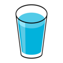

  

<h1 align="center">H2O Reminder - Chrome Browser Extension</h1>

  <strong>Stay hydrated and healthy with timely water intake reminders.</strong>

  <a href="#overview">Overview</a> •
  <a href="#features">Features</a> •
  <a href="#installation">Installation</a> •
  <a href="#usage">Usage</a> •
  <a href="#feedback">Feedback</a> •
  <a href="#license">License</a>

  
   

## Overview

H2O Reminder is a Chrome browser extension designed to promote healthy habits by reminding users to drink water at regular intervals. Proper hydration is essential for maintaining well-being, and this extension ensures you stay hydrated even during busy work hours.

## Features

- Set custom reminder intervals (in minutes).
- Receive non-intrusive notifications reminding you to drink water.
- Save your preferred interval, even if you restart your browser.
- Quick "Test Reminder" button to simulate notifications.
- Simple, user-friendly popup interface.
- Lightweight and unobtrusive design.

## Installation

1. Clone or download this repository.
2. Open your Chrome browser and go to `chrome://extensions/`.
3. Enable "Developer mode" in the top right corner.
4. Click "Load unpacked" and select the cloned/downloaded folder.
5. The H2O Reminder icon should now appear in your browser's extension bar.

## Usage

1. Click on the H2O Reminder icon in your Chrome extensions bar.
2. Set your desired reminder interval (in minutes) using the input field.
3. Click the "Save" button to apply your changes.
4. You'll receive notifications reminding you to drink water at the specified interval.
5. To test a reminder, click the "Test Reminder" button.

  
   

   
  

 

## Feedback

Your feedback is invaluable! If you have suggestions, feature requests, or encounter any issues, please don't hesitate to [open an issue](../../issues) or submit a pull request. Let's work together to make H2O Reminder even better!

## License

This project is licensed under the [MIT License](LICENSE).

---

  Created with ❤️ by Karan Mahajan

